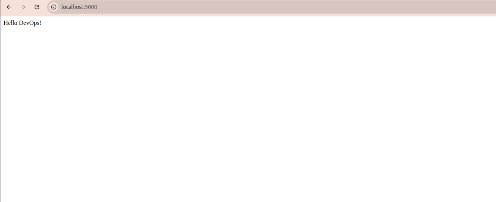

# DevOps Project

This is a simple Flask application containerized using Docker.

## Steps:
- Created Flask app
- Used Git & GitHub
- Dockerized application
- Ran container on port 5000

## Output:
http://localhost:5000
## output screenshot

